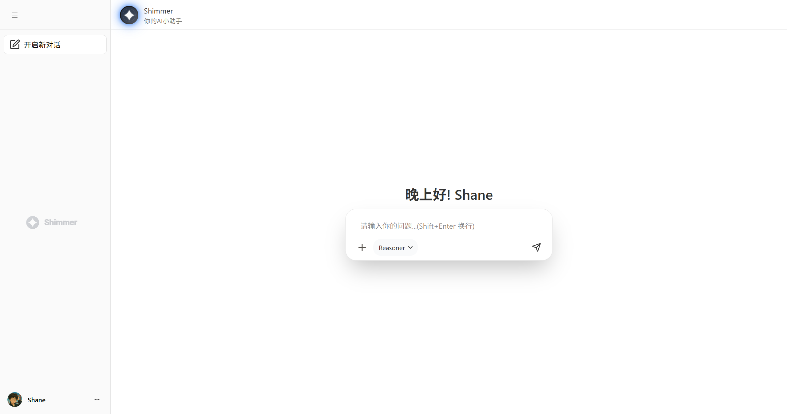
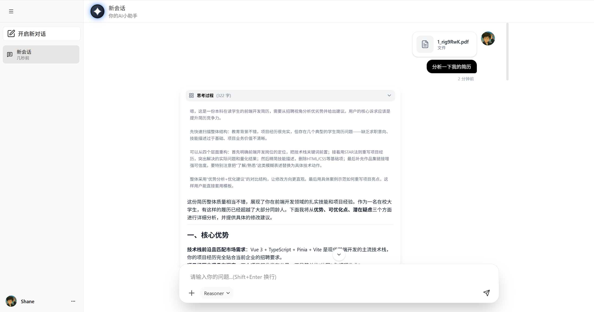
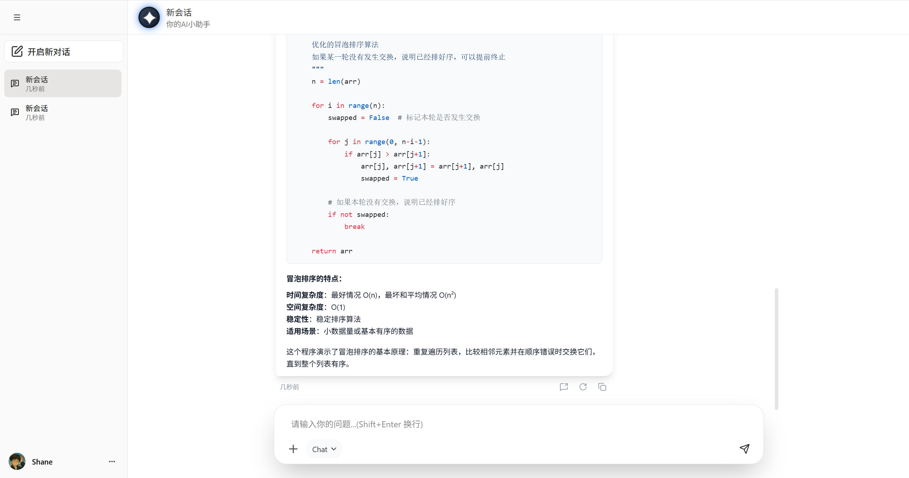
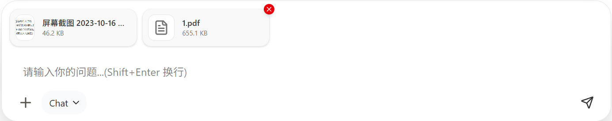
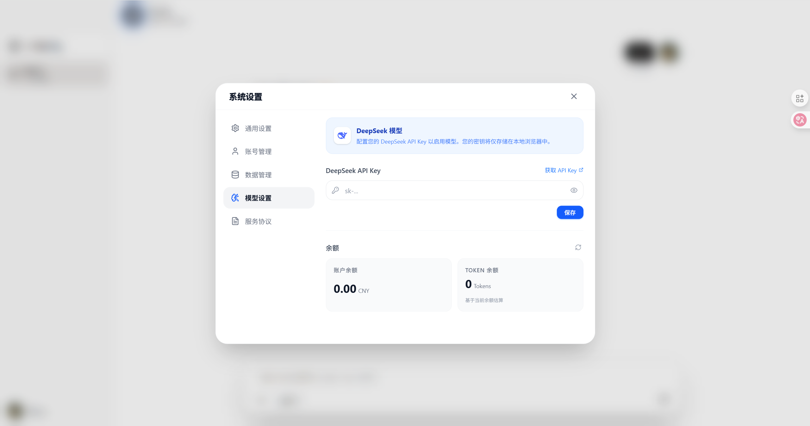
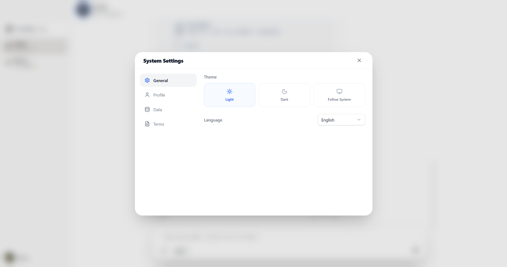
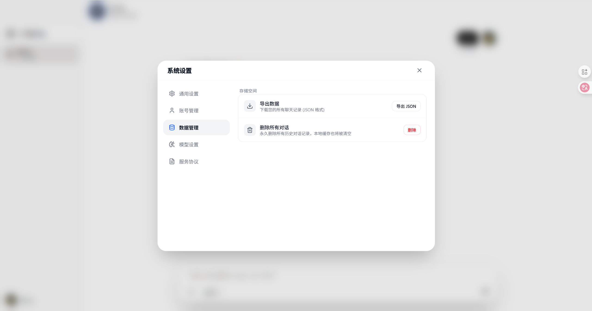
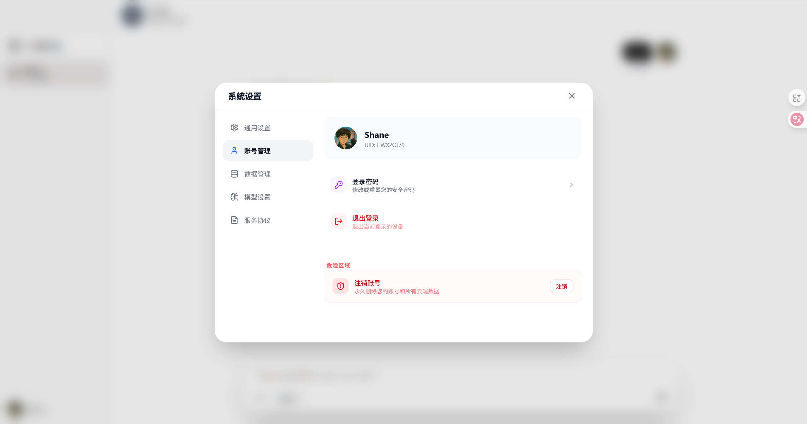

<div align="center">  </div>

<h1 align="center">Shimmer AI ChatBot</h1>

<p align="center">
  <a href="https://github.com/ShaneChing7/Shimmer-AIChatBot">
    
  </a>
  <a href="https://github.com/ShaneChing7/Shimmer-AIChatBot">
    
  </a>
  <a href="https://github.com/ShaneChing7/Shimmer-AIChatBot">
    
  </a>
  <a href="https://github.com/ShaneChing7/Shimmer-AIChatBot">
    
  </a>
  <a href="https://github.com/ShaneChing7/Shimmer-AIChatBot">
    
  </a>
</p>


<p align="center"> 一个基于 Vue 3 + TypeScript + Django 构建的现代化 AI 对话应用。


集成 DeepSeek API，支持流式响应、多轮对话及思维链（CoT）展示，旨在提供流畅、智能的交互体验。 </p>

<div align="center">  </div>

## 📖 简介 | Introduction

**Shimmer AIChatBot** 是一个前后端分离的 AI 聊天项目。前端采用最新的 Vue 3 生态系统构建，UI 风格简洁现代；后端基于 Django 开发。

本项目专注于解决大模型对话中的用户体验痛点，实现了诸如**消息虚拟滚动**（优化长列表性能）、**思维链展示**（透视模型推理过程）以及**流式打字机效果**等高级功能。

## 🚀 核心功能 | Features

### 🤖 深度 AI 集成与推理可视化

- **DeepSeek API 集成**：原生支持 DeepSeek 系列模型。
- **思考过程展示 (Reasoner)**：可视化展示 AI 的 "思考/推理" 过程，支持折叠/展开，透视大模型的思维链 (Chain of Thought)。
- **流式响应 (Streaming)**：通过 SSE 实现实时的打字机输出效果。

<div align="center">  <p><i>DeepSeek 模型推理过程展示</i></p> </div>

### ⚡ 极致交互与 Markdown 渲染

- **Markdown 完美渲染**：支持代码高亮、数学公式 (LaTeX)、表格及各种复杂 Markdown 语法。
- **虚拟滚动**：基于 `vue-virtual-scroller`，即使数千条消息也能保持页面丝滑。
- **智能滚动控制**：新消息自动跟随底部，查看历史时自动暂停。

<div align="center">  <p><i>丰富的 Markdown 渲染支持</i></p> </div>

### 🛠️ 多模态交互与文件支持

- **文件与图片上传**：支持用户上传附件，实现多模态交互体验。
- **统一 API 管理**：封装 Axios 拦截器，统一处理请求与响应逻辑。

<div align="center">  </div>

## 📸 功能概览 | Gallery

| 模型设置                                                     | 主题切换                                                     |
| ------------------------------------------------------------ | ------------------------------------------------------------ |
|  |  |
| **数据管理**                                                 | **账号管理**                                                 |
|  |  |

## 🛠 技术栈 | Tech Stack

### 前端 (Frontend)

- **核心框架**: [Vue 3](https://vuejs.org/) (Composition API)
- **语言**: [TypeScript](https://www.typescriptlang.org/)
- **构建工具**: [Vite](https://vitejs.dev/)
- **UI 框架**: [Tailwind CSS](https://tailwindcss.com/) + [shadcn-vue](https://www.shadcn-vue.com/)
- **状态管理**: [Pinia](https://pinia.vuejs.org/)
- **性能优化**: vue-virtual-scroller
- **国际化**: Vue I18n

### 后端 (Backend)

- **框架**: [Django](https://www.djangoproject.com/) (Rest Framework)

## 📂 项目结构 | Project Structure

```
src/
├── api/                # API 接口定义与统一管理
├── assets/             # 静态资源
├── components/         # 公共组件
│   ├── ai-elements/    # AI 特定组件
│   ├── chatArea/       # 聊天主区域组件
│   ├── sidebar/        # 侧边栏会话列表
│   └── ui/             # shadcn 通用 UI 组件
├── i18n/               # 国际化配置
├── lib/                # 工具库 (utils)
├── locales/            # 语言包文件
├── router/             # 路由配置
├── store/              # Pinia 状态管理
│   └── modules/        # 状态模块 (chat, model, setting, user)
├── style/              # 全局样式
├── utils/              # 辅助函数
├── views/              # 页面视图
│   ├── ChatView/       # 聊天主视图
│   └── 404/            # 404 页面
├── App.vue             # 根组件
├── main.ts             # 入口文件
└── permission.ts       # 权限控制
```

## 🏁 快速开始 | Getting Started

### 环境要求

- Node.js >= 18
- pnpm (推荐) 或 npm/yarn

### 1. 克隆项目

```
git clone [https://github.com/ShaneChing7/Shimmer-AIChatBot.git](https://github.com/ShaneChing7/Shimmer-AIChatBot.git)
cd Shimmer-AIChatBot
```

### 2. 安装依赖

```
pnpm install
```

### 3. 环境配置

在项目根目录创建 `.env` 文件：

```
VITE_API_BASE_URL=http://your-django-backend-api
```

### 4. 启动开发服务器

```
pnpm dev
```

访问 `http://localhost:5173` 即可。

## ⚙️ 配置说明 | Configuration

1. **API Key 设置**: 项目启动后，在设置面板输入 DeepSeek API Key (本地存储)。
2. **后端连接**: 确保 Django 后端服务已启动并配置正确。

## 🤝 贡献 | Contributing

欢迎提交 Pull Request 或 Issue！

## 📄 许可证 | License

本项目遵循 [MIT License](https://www.google.com/search?q=LICENSE) 许可证。

Designed with ❤️ by [Shane](https://github.com/ShaneChing7)